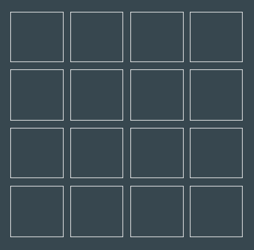
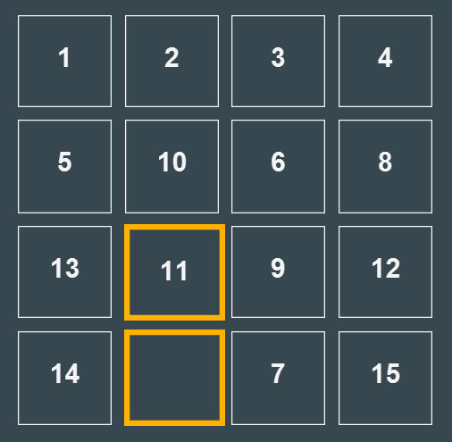
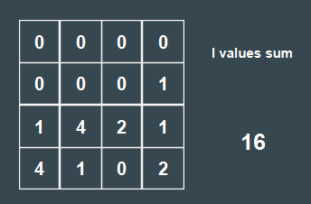
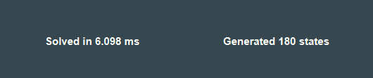
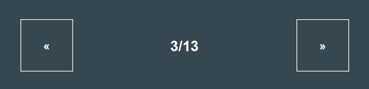

<div id="top"></div>
<br />
<div align="center">
  <a href="https://github.com/Radenz/fifteenp">
    
  </a>

<h3 align="center">fifteenp</h3>
<h4 align="center">By Raden Rifqi Rahman (13520166)</h4>
 <p align="center">
    A simple 15-puzzle solver application written in Java
    <br />
    <a href="demo">View demo</a>
    ·
    <a href="https://fifteenp-docs.web.app/">Documentation</a>
</div>

#### Table of Contents
- [About The Project](#about-the-project)
- [Getting Started](#getting-started)
    - [Prerequisites](#prerequisites)
    - [Packaging and creating runtime image](#packaging-and-creating-runtime-image)
        - [Packaging using IntelliJ](#packaging-using-intellij)
        - [Packaging using Maven](#packaging-using-maven)
    - [Installation](#installation)
    - [One step build](#one-step-build)
        - [Building using python](#building-using-python)
        - [Building using shell](#building-using-shell)
- [Usage](#usage)
    - [Specifying input](#specifying-input)
    - [Solving the puzzle](#solving-the-puzzle)
    - [Reading the output](#reading-the-output)

## About The Project
This is a simple application written in Java to solve 15-puzzle
game, i.e., to find a sequence of moves to reach the goal of
15-puzzle.
The application accepts text file or directly typed number matrix
inside the application as an input.
The application can also generate randomized input to solve.
Upon solving a puzzle, the application will output interactive
sequence of moves to the goal which can be executed back and forth.
This project is made to fulfill `Tugas Kecil 3 IF2211 Strategi Algoritma`.

## Getting Started

### Prerequisites

You will need [Java](https://www.java.com/en/download/) and JDK 17 which
can be downloaded [here](https://www.oracle.com/java/technologies/downloads/)
to build the application from source. You will also need
[IntelliJ IDEA](https://www.jetbrains.com/idea/download/) or
[Maven](https://maven.apache.org/) with JavaFX plugin
to package the source and create runtime image.

The following sections will guide you to build the application
from source. However, the steps need to be done is quite complicated.
If you want to avoid complicated steps, see [One step build](#one-step-build)
instead.

### Packaging and creating runtime image
To package the source, you will need to do the following steps.

#### Packaging using IntelliJ
1. Open the root folder as IntelliJ IDEA project.
2. Go to `Maven` in the right sidebar then expand `Lifecycle`.
3. Choose `package`.
4. Wait until the packaging process is finished.
5. Expand `Plugins` and select `javafx`.
6. Choose `javafx:jlink`.
7. Wait until the runtime image is created.

#### Packaging using Maven
1. Run the `package` lifecycle task.
```
mvn package
```
2. Wait until the packaging process is finished.
3. Run `jlink` task from the `javafx` plugin.
```
mvn javafx:jlink
```
4. Wait until the runtime image is created.

### Installation
After doing the previous steps, there should now be compiled
`.class` files, a `fifteenp.jar` file, and `image` directory
inside `target` directory. You will now need to package the
artifact and runtime image into a binary executable with
`jpackage` tool.
```
jpackage -t app-image --input target --main-jar fifteenp.jar --main-class id.ac.itb.stei.informatika.fifteenp.Application --runtime-image target/image --dest bin --name fifteenp
```
Wait until the packaging is finished and there should now
be a `fifteenp` directory inside the `bin` directory with
the binary executable application inside.

### One step build
If you don't want to go through complicated building process,
you can also do a one-step build process with python or shell.
However, the [Prerequisites](#prerequisites) are still mandatory.

#### Building using python
To build the application using python, execute `build.py` script
```
py build.py
```
and wait until the script is finished.

#### Building using shell
To build the application using shell, execute `build.sh` script
```
sh build.sh
```
and wait until the script is finished.

## Usage

### Specifying input
There are various methods to specify 15-puzzle input for the application
to solve. Within the application, there is a 4 x 4 grid for the puzzle to
display.



You can directly modify the value inside each cell in the grid to 0-15 or
blank. You can also do this after solving another puzzle beforehand.

The second way to specify a puzzle input for the application is through
a text file. The text file for the puzzle should have a specific format for
it to work with the application. Each row in the puzzle matrix should be
separated by exactly one line feed `\n` character and each column should be
separated by exactly one whitespace `\s` character. The file should have
exactly 4 lines and each line should have exactly 4 separated column.
For each column, the value should be 0-15 or `-` for the blank tile.

For example, this is a valid text input file as can be seen in [13.txt](test/13.txt)
```
1 2 3 4
5 10 6 8
13 11 9 12
14 - 7 15
```
Once you have your text file ready, you can import them by pressing
the `Choose File ...` button in the bottom right corner.


The third way to specify an input is _to not specify it_. By pressing
the `RANDOM` button, the application will randomize the grid with a
semi-randomly generated valid solvable puzzle.

### Solving the puzzle

Once you have an input displayed in the application, all you need
to do is to press the `SOLVE` button to start solving the puzzle.
After the puzzle is solved, there will be several output within the
application including the first move of the solution.



### Reading the output

Besides the moves, there are some other outputs displayed in the
application. In the bottom left corner, there is also a 4 x 4 matrix
with a seemingly arbitrary values on each cell. These values are the
l-value of each cell in the puzzle. The `l values sum` is the sum
of all l-values and the x value. For more information, see
[Branch and Bound lecture note](http://www.cs.umsl.edu/~sanjiv/classes/cs5130/lectures/bb.pdf).



In the bottom right corner, there is also an output of the **solving duration**
and **total generated states** during the solving process.



In the middle, there is a depth indication of the current state
in the solution path to reach the goal state. For example, in the
following image, we are currently in depth 3 of the solution;
whereas the goal is on the depth 13.



There are also next and previous button to navigate the state backwards
and forwards, respectively, throughout the solution path.
